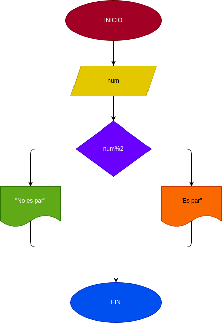

# Par_Impar 
pograma para verificar si un numero es par es impar.

## Input
### Processing 
si n: n % 2 = 0 se determinaque es par 

si n: % 2 = 0 se determina  de que es impar  

### output
respuesta 
# Diseño 
 